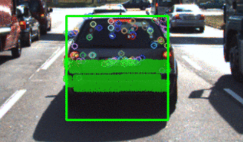
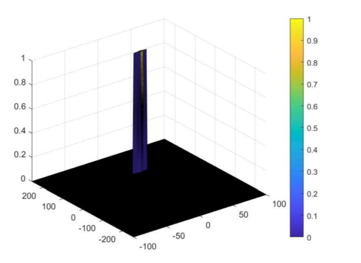
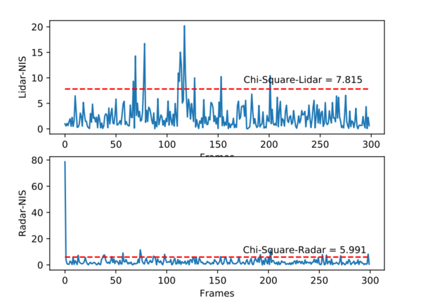

# Sensor Fusion Engineer

Now I will gather all my finished codes about the projects of **[Sensor Fusion Engineer](https://www.udacity.com/course/sensor-fusion-engineer-nanodegree--nd313)**  of four projects.  

<table style="width:100%">
  <tr>
    <th>
      

           
            P1: Lidar
            <a href="https://github.com/lilyhappily/SFND-P1-Lidar-Obstacle-Detection" name="p1_code">(code)</a>
      

    </th>
        <th>

           
            P3: Camera
            <a href="https://github.com/lilyhappily/SFND_P3_2D_Feature_Tracking" name="p3_code">(code1) </a>
              <a href="https://github.com/lilyhappily/SFND-P3-3D_Object_Tracking" name="p3_code">(code2) </a>
        

    </th>
  </tr>
  <tr>
    <th>

           
            P2: Radar
            <a href="https://github.com/lilyhappily/SFND-P2-radar-target-generation-and-detection" name="p2_code">(code) </a>
        

</th>
    <th>

       
        P4: UKF
        <a href="https://github.com/lilyhappily/SFND-P4-Unscented_Kalman_Filter" name="p4_code">(code)</a>
    

</th>
</tr>
</table>

## [Part1: Lidar](https://github.com/lilyhappily/SFND-P1-Lidar-Obstacle-Detection)

**Summary:** Process raw lidar data with PCL library to detect other vehicles on the road.  Firstly, filter raw data using VoxGrid so as to compute rapidly and crop the interesting region . Secondly,  RanSac with a plane model to segment the Point Cloud Data  into pointd that are part of road and points that are not. And then, cluster the obstacle points using KD-Trees.

**Keywords:** PCL, VoxGrid, RanSac, KD-Trees

## [Part2: Radar](https://github.com/lilyhappily/SFND-P2-radar-target-generation-and-detection)

**Summary:** Analyze FMCW radar signatures to detect and track objects.  Using processing techniques like Range/Doppler FFT, CFAR to create the Range Doppler Maps (RDM). Estimate the range and velocity of target using FMCW radar.

**Keywords:** FMCW, FFT, Doppler, CFAR

## [Part3-1: Camera](https://github.com/lilyhappily/SFND_P3_2D_Feature_Tracking) [Part3-2: Camera](https://github.com/lilyhappily/SFND-P3-3D_Object_Tracking) 

**Summary:**  Find the best detector/descriptor combination from camera images and project  the lidar data into two dimensions to fuse with camera image. Combine the yolov3 model to group the keypoints and lidar data belong to the preceding car to compute TTC(time-to-collision).

**Keywords:**  YOLOv3, homogeneous coordinate, Camera intrinsic and extrinsic  matrix

## [Part4: Kalman Filters](https://github.com/lilyhappily/SFND-P4-Unscented_Kalman_Filter)

**Summary:** Fuse data from multiple sources using Kalman filters, and build extended and Unscented Kalman Filters(UKF) for tracking nonlinear movement.  UKF model combining with  sigma points generation, sigma point prediction, state mean and covariance prediction and measurement prediction to track the objections. NIS is used to check KF model consistency. 

**Keywords:**  Kalman Filter, UKF, Sigma points, CTRV model, NIS consistency